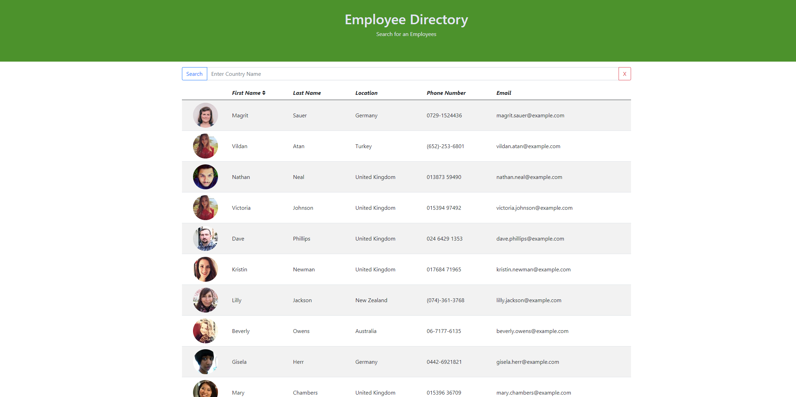
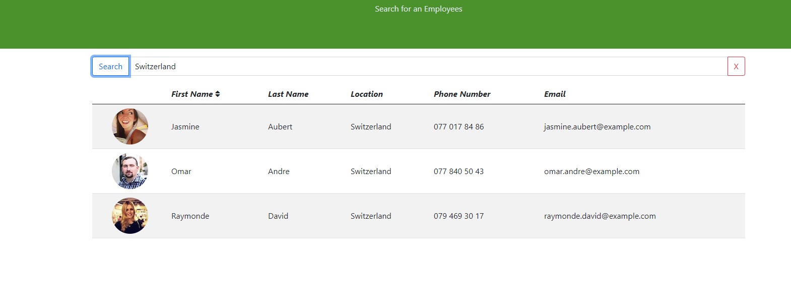

# User Directory

### Table of Contents  
[Description](#Description)\
[Install Instructions](#Install-Instructions)\
[Usage Information](#Usage-Information)\
[Contribution Guidelines](#Contribution-Guidelines)\
[Testing Guidelines](#Testing-Guidelines)\
[License](#License)\
[Questions](#Questions)

## Description
An employee directory created using React. User are able to query members by country and sort by first name.

## Install Instructions
.

## Usage Information
.

## Contribution Guidelines
.

## Testing Guidelines
.

## License
You are using the MIT license, click on the badge at the top of the page for more information.

## Questions
You can find me on [GitHub](https://github.com/AdamAranha) or you can reach me by email [here](mailto:a3aranha@gmail.com).

[Live Link on Heroku](https://mighty-cliffs-42721.herokuapp.com/)

